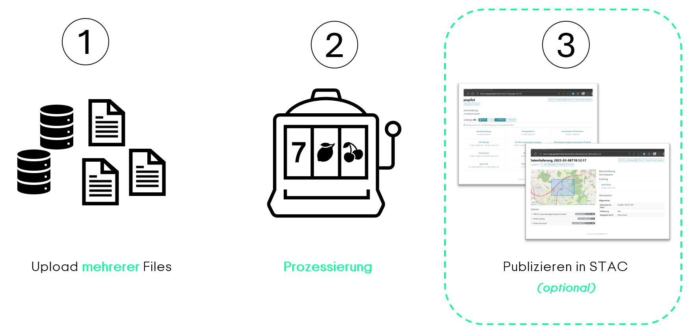
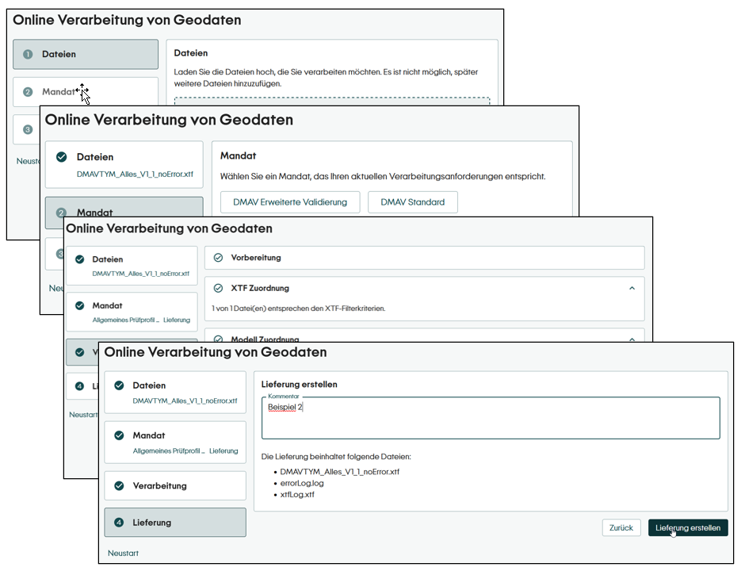
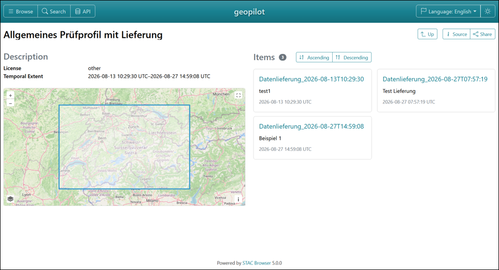
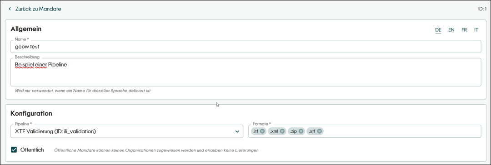
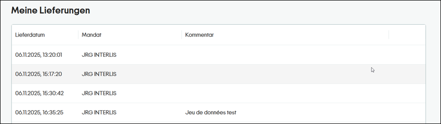
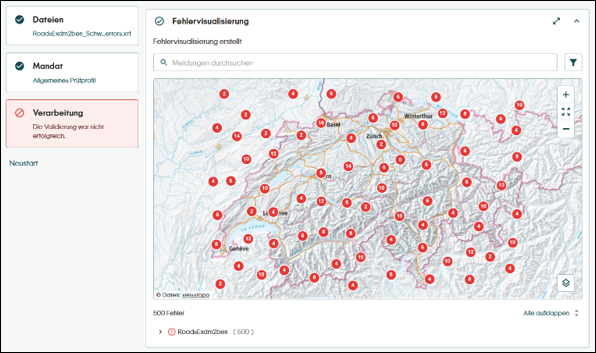
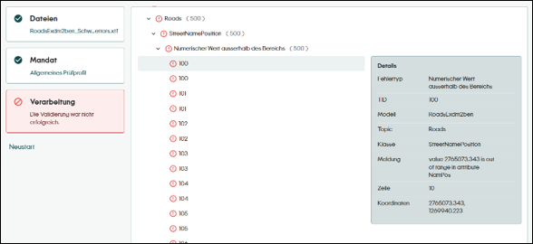

# geopilot Version 2.0

## Übersicht
**geopilot wird von der reinen Validierungsplattform zur konfigurierbaren Prozessierungsplattform.**

Neu unterstützt geopilot mit seiner flexiblen Pipeline-Architektur beliebige Verarbeitungsabläufe von einer oder mehreren hochgeladenen Dateien. Über eine intuitive Oberfläche führt geopilot Datenlieferanten in drei einfachen Schritten zum Ziel:

1. **Hochladen:** Beliebig viele Dateien in freien Formaten hochladen
2. **Prüfen & Verarbeiten:** Die Daten werden automatisch darauf geprüft, ob sie die geforderten Kriterien erfüllen, und bei Bedarf weiterverarbeitet.
3. **Lieferung (Optional):** Nur Daten, die die Prüfung bestehen, können freigegeben und im STAC-Katalog abgelegt werden.

## Neuigkeiten

### UI / UX 
#### Redesign
geopilot kommt mit einer neuen grafischen Oberfläche und einer neuen Benutzerführung daher. Das neue UI ermöglicht die Darstellung aller neuen Features und führt den Benutzer auch ohne Vorkenntnisse klar durch den Prozess.

Das neue UI ist auch für mobile Geräte geeignet und passt sich der Bildschirmgrösse an. Die Benutzerführung ist in mehreren Sprachen (DE/EN/FR/IT) verfügbar und kann bei Bedarf auf weitere Sprachen übersetzt werden.

#### Customizing
Neu können auch folgende Elemente in der Konfiguration von geopilot umbenannt werden:
* Applikationsnamen
* Applikationstitel
* Logo

Titel und Name können mehrsprachig erfasst werden.

#### STAC Browser
Auch der STAC-Browser erhält ein neues Gesicht. Mit dem Update auf die Version 5.0 kommt das UI moderner daher.

### Authentifizierung

#### Selbstregistrierung
Neu werden Benutzer in geopilot beim ersten Anmelden automatisch angelegt (noch ohen spezifische Zuordnung / Berechtigung). Dies ermöglicht eine Selbstregistrierung von neuen Benutzern.

#### Konfiguration öffentlicher Mandate
Prüfungen und Prozessierungen können neu auch ohne Login ausgeführt werden. Als 'öffentlich' gekennzeichnete Mandate stehen allen Benutzer:innen offen. Zudem können die Informationen zu einem Mandat (Titel / Beschreibung) neu mehrsprachig erfasst werden.

#### Ansicht eigener Lieferungen
Neu steht jedem eingeloggten Benutzer eine Übersicht über seine getätigten Lieferungen zur Verfügung.

In den Applikationssettings kann eingestellt werden, ob der Benutzer ungewünschte Lieferungen bis zu einem bestimmten Moment wieder löschen kann.

### Datenupload
Mit geopilot 2.0 können neu auch grössere Datenmengen verarbeitet werden. Die bisherige Grössenbeschränkung von 100 MB wurde aufgehoben. Neu kann nicht nur eine Datei, sondern es können beliebig viele Dateien hochgeladen werden. geopilot evaluiert aus den hochgeladenen Dateien anschliessend die passenden Mandate.

### Prozessierung
Neben der bewährten INTERLIS-Validierung können mit geopilot neu ganze Abläufe definiert werden. Mit Prozessoren, Bedingungen und Parametern können mehrere Schritte miteinander verkettet werden. Die Ausführung und Weiterleitung von Dateien im Prozess kann über Bedingungen zusätzlich gesteuert werden. Die Konfigurationsmöglichkeiten erlauben nun auch die Definition der Lieferobjekte (welche hochgeladenen Objekte und Resultate werden im STAC abgelegt). So können neu z. B. auch Dokumentationen hochgeladen und abgegeben werden.
Weitere Informationen zu den Möglichkeiten von Pipelines und deren Konfiguration befinden sich hier: [Dokumentation geopilot Pipelines](../pipeline/Pipelines.md)

#### Standardprozessoren
geopilot unterstützt neu neben der Validierung von INTERLIS-Transferdateien auch weitere Prozessschritte. Mit der Installation stehen folgende Prozessoren automatisch zur Verfügung:
* FileMatcherProcess
* XtfMatcherProcess
* XtfErrorVisualizationProcess
* XtfValidatorProcess (basierend auf ilivalidator)
* ZipPackageProcess
* UnzipProcess

Eine detaillierte Beschreibung der Prozessoren befindet sich unter [Dokumentation geopilot Prozessoren](../pipeline/Pipelines.md#prozesse).

So können Dateitypen und Modellnamen automatisch erkannt, INTERLIS-Dateien validiert und die Fehler anschliessend visualisiert werden. Mit dem Zip/Unzip können Resultate vor der Verarbeitung oder für den Download schöner aufbereitet werden.

Die Architektur von geopilot ermöglicht es, eigene Prozessoren zu schreiben und in die Prozesskette einzubinden. Für weitere Informationen kontaktieren Sie uns.

#### Fehlervisualisierung
Nach einer INTERLIS-Validierung können allfällige Validierungsfehler neu in einer Karte und/oder einem Baum dargestellt und so einfacher analysiert und überblickt werden.

<table>
  <tr>
    <td width="50%"></td>
    <td width="50%"></td>
  </tr>
</table>

Karte und Baum interagieren miteinander und kommen mit einer Vielzahl von Funktionen und Konfigurationsmöglichkeiten daher:
* Automatisch
  * Interaktion zwischen Karte & Baum
  * Tooltips auf Karte (wenn nur Karte)
  * Vollbildmodus
  * Layerswitch
  * Suchfeld

* Konfigurierbar
  * Karte und/oder Baum
  * Hintergrundkarte
  * Copyright der Hintergrundkarte
  * Gruppierung (z. B. Modell, Topic, Klasse)
  * Filter (z. B. Klasse, Error-Typ)

## Bugfixes
| Issue | Beschreibung |
| --- | --- |
| #683 | Eigene Modelle können wieder mitgeliefert werden |

## Technische Abhängigkeiten

### Backend (.NET)
| Framework / Library | Version |
| --- | --- |
| .NET | 10.0 (`net10.0`) |
| ASP.NET Core Authentication JwtBearer | 10.0.1 |
| ASP.NET Core MVC NewtonsoftJson | 10.0.1 |
| ASP.NET Core OpenAPI | 10.0.1 |
| Asp.Versioning.Mvc | 8.1.1 |
| Asp.Versioning.Mvc.ApiExplorer | 8.1.1 |
| Azure Storage Blobs | 12.27.0 |
| Entity Framework Core | 10.0.1 |
| Entity Framework Core Design | 10.0.1 |
| Npgsql Entity Framework Core PostgreSQL | 10.0.0 |
| Npgsql NetTopologySuite | 10.0.1 |
| Swashbuckle ASP.NET Core | 10.1.0 |
| YARP Reverse Proxy | 2.3.0 |
| Microsoft.OpenApi | 2.7.5 |
| DotNetStac.Api | 1.0.0-beta.5 |
| Geowerkstatt.IlitoolsWrapperApi | 1.1.10-preview |
| YamlDotNet | 16.3.0 |
| NCalc.Core | 6.2.0 |
| Cronos | 0.13.0 |
| nClam | 9.0.0 |
| Humanizer.Core | 3.0.1 |

### Frontend
| Framework / Library | Version |
| --- | --- |
| React | 19.2.8 |
| React DOM | 19.2.8 |
| Material UI | 9.3.1 |
| MUI X Data Grid | 9.11.0 |
| MUI X Tree View | 9.11.0 |
| Emotion React | 11.14.0 |
| Emotion Styled | 11.14.1 |
| OpenLayers | 10.9.0 |
| Proj4 | 2.20.9 |
| React Router DOM | 7.18.2 |
| React Hook Form | 7.85.0 |
| React Dropzone | 20.1.0 |
| React Markdown | 10.1.0 |
| i18next | 26.3.6 |
| React i18next | 17.0.11 |
| OIDC Client TS | 3.0.1 |
| React OIDC Context | 3.1.0 |
| Vite | 8.2.1 |
| TypeScript | 5.5.3 |