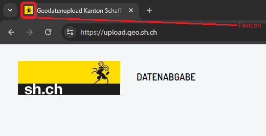
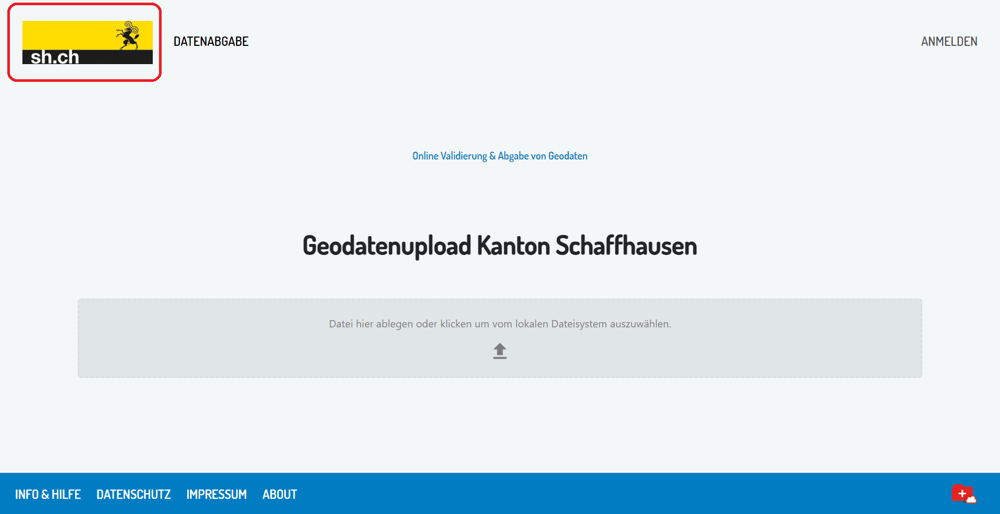

# Dokumentation zur Administration einer eigenen geocop-Instanz  

## 1. Konfigurationsanpassungen der Assets zur Personalisierung der eigenen geocop-Instanz
Die Assets umfassen die Personalisierung der Website der eigenen geocop-Instanz und damit die Abweichungen von der Standard-geocop-Website.
Alle in diesem Kapitel erwähnten Asset-Dateien mit Ausnahme der Versions- und Lizenzinfo werden unter ./assets abgelegt.

+ **Info & Hilfe:** In der Datei **info-hilfe.md** wird inform einer Markdown-Datei der Inhalt hinterlegt, der den Website-Usern beim Klick auf den Info- und Hilfe-Button angezeigt wird.

+ **Angaben zum Datenschutz:** Die Datenschutzerklärung wird in der Datei **datenschutz.md** hinterlegt, ebenfalls im Markdown-Format:

+ **Impressum:** Das Impressum wird ebenfalls als Markdown-Datei mit Namen **impressum.md** abgespeichert.

+ **About (Version und Lizenz):** Die Versions- und Lizenzinformationen befinden sich in der JavaScript-Textdatei ./src/GeoCop.Frontend/src/About.jsx.
Die Lizenzinformation wird in Form einer JSON-Datei hinterlegt mit Namen **license.json**. Soll eine von der MIT-Lizenz abweichende Lizenz verwendet werden, lässt sich eine zusätzliche Datei als **license.custom.json** ablegen.

+ **Browser Tab Icon (favicon):** Das im Tab des Webbrowsers zu sehende kleine Icon wird als *.ico-Datei mit Namen **favicon.ico** hinterlegt.

+ **Logo:** Das links oben auf der Website zu sehende Logo ist ein effektives Mittel, die eigene geocop-Instanz auf den ersten Blick optisch von anderen Instanzen unterscheidbar zu machen. Hierfür wird eine *.png-Bilddatei mit Namen **vendor.png** hinterlegt.

## 2. Konfigurationsoptionen in der Datenbank
Ein Teil der Konfigurationen (insbesondere User-Management) wird direkt in der geocop-eigenen PostgreSQL-Datenbank vorgenommen. Hierfür kann ein beliebiger SQL-Editor verwendet werden, z.B. pgAdmin oder DBeaver, auch ein Zugriff via QGIS ist möglich. Der Datenbankname lautet "geocop", die benötigten Tabellen befinden sich im Schema "public".

### 2.1 Organisationen erfassen und verwalten
In dieser Tabelle werden Organisationen verwaltet, die zum Datenupload berechtigt sind.

#### Hinzufügen einer neuen Organisation
Mit dem folgenden SQL-Befehl kann eine neue Organisation hinzugefügt werden. Die ID (Primärschlüssel) wird automatisch durch die Datenbank vergeben, es muss lediglich ein Name spezifiziert werden (in diesem Fall *Beispielorganisation*)

~~~sql
INSERT INTO public."Organisations" ("Name") VALUES ('Beispielorganisation');
~~~

### 2.2 User verwalten und mit Organisationen verknüpfen
Die Usertabelle beinhaltet alle Logins, die für Datenabgaben benötigt werden.

#### 2.2.1 Hinzufügen eines neuen Users
Die Erfassung neuer User funktioniert nach demselben Prinzip wie die Erfassung neuer Organisationen *(Punkt 2.1)*. Der Wert für das Feld "AuthIdentifier" (im folgenden Codebeispiel '***') muss manuell aus dem Authentifizierungssystem übernommen werden. Falls der IDP durch die GeoWerkstatt betrieben wird, ist kundenseitig kein Zugriff auf die Usertabelle möglich und der Eintrag wird von der GeoWerkstatt vorgebommen. Der letzte Wert in der Tabelle "Users" ist ein Boolean. Wird er auf TRUE gesetzt, erhält der User Administratorrechte.

~~~sql
INSERT INTO public."Users" ("AuthIdentifier", "Email", "FullName", "IsAdmin")
VALUES ('***', 'beispieluser@organisation.com', 'Rudolf Raumdatenlieferant', FALSE);
~~~

#### 2.2.2 User einer Organisation zuweisen
User müssen einer Organisation angehören. Mit folgendem Befehl lässt sich eine über die Zwischentabelle eine Zuweisung vornehmen:

~~~sql
INSERT INTO public."OrganisationUser" ("OrganisationsId", "UsersId")
SELECT A."Id", B."Id"
FROM public."Organisations" AS A
JOIN public."Users" AS B ON A."Name" = 'Beispielorganisation' AND B."FullName" = 'Rudolf Raumdatenlieferant';
~~~

### 2.3 Datenlieferungsmandate hinzufügen und Organisationen zuweisen
Datenabgaben in geocop werden immer einem Mandat zugeordnet. Ein Mandat kann durch mehrere Organisationen wahrgenommen, aber auch mehrere Mandate einer Organisation zugeordnet werden (n:m-Beziehung).

#### 2.3.1 Hinzufügen eines neuen Mandats
Mit dem folgenden Befehl können neue Mandate erfasst werden. Typische Mandate umfassen z.B. die Kombination aus einem Thema und einer Gemeinde. Zusätzlich werden zulässige Dateitypen für Datenabgaben innerhalb dieses Mandats festgelegt.

> geocop unterstützt (Stand 02/2024) die Formate INTERLIS 1 (\*.itf) INTERLIS 2 (\*.xtf), XML (\*.xml), Geopackage (\*.gpkg - ohne Prüfmöglichkeit) sowie gezippte Dateien dieser Formate (\*.zip.). Der entsprechende Wert muss in Form einer Liste übergeben werden.

> Mandate haben in der geocop-Administrationsdatenbank eine Bounding Box, durch die sie geographisch verortet werden können. Deren Geometrie muss bei der Erfassung im Well Known Binary (WKB) im KBS 4326 (WGS84) in das Feld "SpatialExtent" eingegeben werden. Dies kann direkt als Text per SQL erfolgen wie im folgenden Beispiel. Alternativ kann die Datenbank auch an ein GIS angebunden und die Bounding Box dort erfasst werden.

~~~sql
INSERT INTO public."DeliveryMandates" ("Name", "FileTypes", "SpatialExtent")
VALUES ('Altdorf SH', '{xtf, xml, zip}', '0103000000010000000500000099B9C0E5B14E21407EACE0B721E4474099B9C0E5B14E21402C9B3924B5E44740F705F4C29D5321402C9B3924B5E44740F705F4C29D5321407EACE0B721E4474099B9C0E5B14E21407EACE0B721E44740');
~~~

#### 2.3.2 Mandat einer Organisation zuweisen
Wie bei der Zuweisung von Usern müssen auch Mandate einer Organisation zugewiesen werden. Die hierfür nötige Zwischentabelle wird durch den folgenden Befehl bestückt:

~~~sql
INSERT INTO public."DeliveryMandateOrganisation" ("MandatesId", "OrganisationsId")
SELECT A."Id", B."Id"
FROM public."DeliveryMandates" AS A
JOIN public."Organisations" AS B ON A."Name" = 'Altdorf SH' AND B."Name" = 'Beispielorganisation';
~~~

## 3. Datenupload und -download via STAC-API
geocop nutzt die STAC-API, über die Zielapplikationen direkt auf die Geodaten zugreifen können.
Die vollständige API-Dokumentation findet sich hier: **https://geocop.ch/swagger/index.html**

### 3.1 Daten- und Metadatenbezug auf Administratorseite via STAC-API mittels FME-Workspace
Aufgrund der grossen Verbreitung von FME für die automatisierte Abfrage von Geodaten stellt die GeoWerkstatt einen FME-Workspace zum Auslesen von Metadaten oder Datenoperaten aus geocop zur Verfügung. Es bedarf nur der Anpassung der Filter und des Authentifizierung, um die gewünschten (Meta-)Daten auszulesen. Zur Authentifizierung muss in FME Workbench in den Optionen unter Tools --> Options --> web connections ein Web Service hinterlegt werden, ansonsten meldet die Abfrage beim ersten HTTP-Caller den Statuscode 401 (kein Zugriff).
Bedienungshinweise sind direkt im Workspace integriert.

> Hinweis: Stand 02.2024 existiert zwar ein eigener STAC-Reader in Form eines FME-Plugins, dieser lässt aber
> leider (noch) keine logingeschützten Abfragen zu und wird aus diesem Grund hier noch nicht verwendet, stattdessen werden API-Befehle vom HTTP-Caller in FME aufgerufen.

### 3.2 Datenupload auf Administratorseite via STAC-API mittels FME-Workspace
Auch für den Upload wird ein FME-Workspace gestellt. Hier gilt für die Authentifizierung dasselbe wie beim Download (*Siehe 3.1*).
Es können Daten geprüft und nach Wunsch des Nutzers in der Folge automatisch abgegeben werden, sofern die Prüfung erfolgreich verläuft. Bedienungshinweise sind direkt im Workspace integriert.