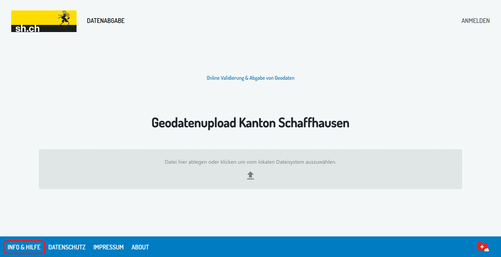
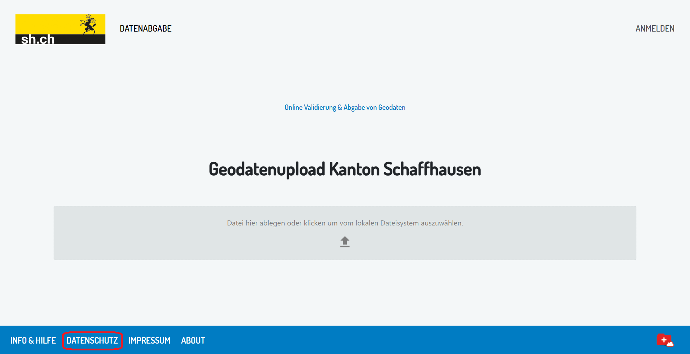
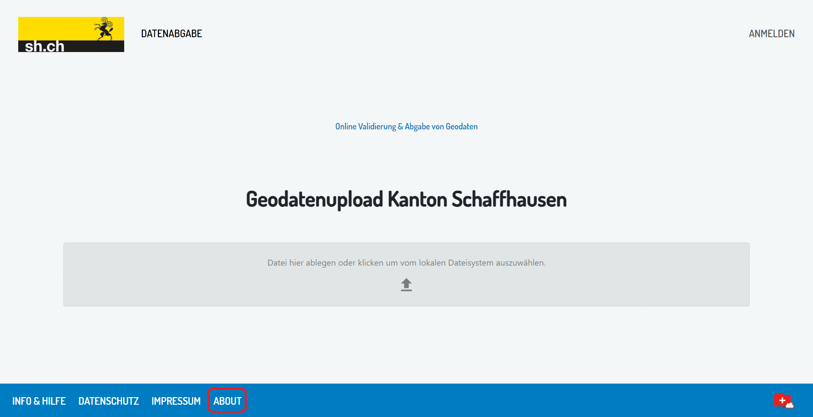
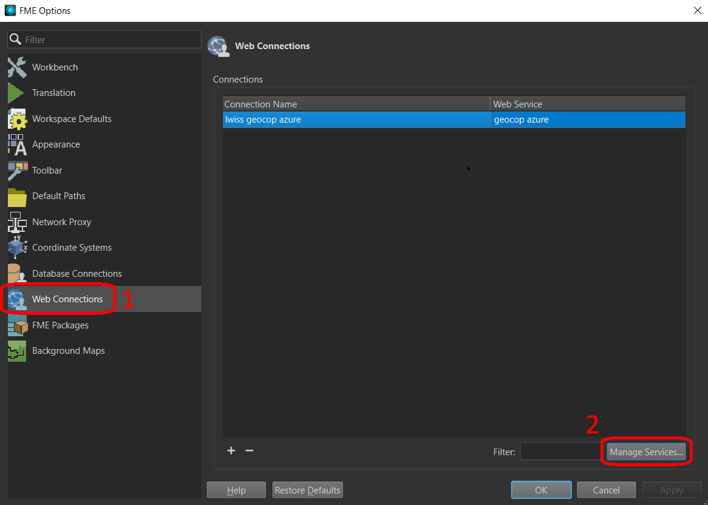
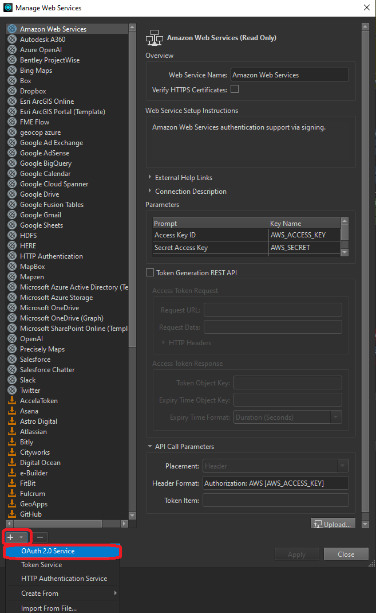

# Dokumentation zur Administration einer eigenen geopilot-Instanz  

## 1. Konfigurationsanpassungen der Assets zur Personalisierung der eigenen geopilot-Instanz
Die Assets umfassen die Personalisierung der Website der eigenen geopilot-Instanz und damit die Abweichungen von der Standard-geopilot-Website.
Alle in diesem Kapitel erwähnten Asset-Dateien mit Ausnahme der Versions- und Lizenzinfo werden unter ./assets abgelegt.

<figure>
    
    <figcaption>Info & Hilfe: In der Datei info-hilfe.md wird inform einer Markdown-Datei der Inhalt hinterlegt, der den Website-Usern beim Klick auf den Info- und Hilfe-Button angezeigt wird.</figcaption>
</figure>

<figure>
    
    <figcaption>Angaben zum Datenschutz: Die Datenschutzerklärung wird in der Datei datenschutz.md hinterlegt, ebenfalls im Markdown-Format.</figcaption>
</figure>

<figure>
    
    <figcaption>Impressum: Das Impressum wird ebenfalls als Markdown-Datei mit Namen impressum.md abgespeichert.</figcaption>
</figure>

<figure>
    
    <figcaption>About (Version und Lizenz): Die Lizenzinformation wird in Form einer JSON-Datei mit Namen license.json automatisch generiert. Sie enthält Referenzen bezüglich Lizenz aller von geopilot verwendeten Abb. 4: Softwarepakete. Sollen Lizenzen angezeigt werden, die auf darüber hinausgehende Pakete verweist, lässt sich eine zusätzliche Datei als license.custom.json hinterlegen.</figcaption>
</figure>

<figure>
    
    <figcaption>Browser Tab Icon (favicon): Das im Tab des Webbrowsers zu sehende kleine Icon wird als \*.ico-Datei mit Namen favicon.ico hinterlegt.</figcaption>
</figure>

<figure>
    
    <figcaption>Logo: Das links oben auf der Website zu sehende Logo ist ein effektives Mittel, die eigene geopilot-Instanz auf den ersten Blick optisch von anderen Instanzen unterscheidbar zu machen. Hierfür wird eine \*.png-Bilddatei mit Namen vendor.png hinterlegt.</figcaption>
</figure>

## 2. Konfigurationsoptionen in der Datenbank
Ein Teil der Konfigurationen (insbesondere User-Management) wird direkt in der geopilot-eigenen PostgreSQL-Datenbank vorgenommen. Hierfür kann ein beliebiger SQL-Editor verwendet werden, z.B. pgAdmin oder DBeaver, auch ein Zugriff per Desktop-GIS (z.B. QGIS) ist möglich. Der Datenbankname lautet "geopilot", die benötigten Tabellen befinden sich im Schema "public".

### 2.1 Organisationen erfassen und verwalten
In dieser Tabelle werden Organisationen verwaltet, die zum Datenupload berechtigt sind.

#### Hinzufügen einer neuen Organisation
Mit dem folgenden SQL-Befehl kann eine neue Organisation hinzugefügt werden. Die ID (Primärschlüssel) wird automatisch durch die Datenbank vergeben, es muss lediglich ein Name spezifiziert werden (in diesem Fall *Beispielorganisation*)

~~~sql
INSERT INTO public."Organisations" ("Name") VALUES ('Beispielorganisation');
~~~

### 2.2 User verwalten und mit Organisationen verknüpfen
Die Usertabelle beinhaltet alle Logins, die für Datenabgaben benötigt werden.

#### 2.2.1 Hinzufügen eines neuen Users
Die Erfassung neuer User funktioniert nach demselben Prinzip wie die Erfassung neuer Organisationen *(Punkt 2.1)*. Der Wert für das Feld "AuthIdentifier" (im folgenden Codebeispiel '***') muss manuell aus dem Authentifizierungssystem übernommen werden. Falls der IDP durch GeoWerkstatt betrieben wird, ist kundenseitig kein Zugriff auf die Usertabelle möglich und der Eintrag wird von GeoWerkstatt vorgebommen. Der letzte Wert in der Tabelle "Users" ist ein Boolean. Wird er auf TRUE gesetzt, erhält der User Administratorrechte.

~~~sql
INSERT INTO public."Users" ("AuthIdentifier", "Email", "FullName", "IsAdmin")
VALUES ('***', 'beispieluser@organisation.com', 'Rudolf Raumdatenlieferant', FALSE);
~~~

#### 2.2.2 User einer Organisation zuweisen
User müssen einer Organisation angehören. Mit folgendem Befehl lässt sich eine über die Zwischentabelle eine Zuweisung vornehmen, indem in der JOIN-Zeile die Namen der Organisation und des Users eingegeben werden.

~~~sql
INSERT INTO public."OrganisationUser" ("OrganisationsId", "UsersId")
SELECT A."Id", B."Id"
FROM public."Organisations" AS A
JOIN public."Users" AS B ON A."Name" = 'Beispielorganisation' AND B."FullName" = 'Rudolf Raumdatenlieferant';
~~~

### 2.3 Datenlieferungsmandate hinzufügen und Organisationen zuweisen
Datenabgaben in geopilot werden immer einem Mandat zugeordnet. Ein Mandat kann durch mehrere Organisationen wahrgenommen, aber auch mehrere Mandate einer Organisation zugeordnet werden (n:m-Beziehung).

#### 2.3.1 Hinzufügen eines neuen Mandats
Mit dem folgenden Befehl können neue Mandate erfasst werden. Typische Mandate umfassen z.B. die Kombination aus einem Thema und einer Gemeinde. Zusätzlich werden zulässige Dateitypen für Datenabgaben innerhalb dieses Mandats festgelegt.

> geopilot validiert (Stand 02/2024) die Formate INTERLIS 1 (\*.itf) INTERLIS 2 (\*.xtf), XML (\*.xml), ili2gpkg-konformes Geopackage (\*.gpkg) sowie ZIP-Archive von xml, xtf und itf.Dateien (\*.zip.). Der entsprechende Wert muss in Form einer Liste übergeben werden. Mittels einer Wildcard in der Datenbank können auch alle Dateiformate zur Abgabe akzeptiert werden (im untenstehenden Skript {.*} im Feld "FileTypes").

> Mandate haben in der geopilot-Administrationsdatenbank eine Bounding Box, durch die sie geographisch verortet werden können. Deren Geometrie muss bei der Erfassung im Well Known Binary (WKB) im Koordinatenbezugssystem WGS84 (EPSG: 4326) in das Feld "SpatialExtent" eingegeben werden. Dies kann direkt als Text per SQL erfolgen wie im folgenden Beispiel. Alternativ kann die Datenbank auch an ein GIS angebunden und die Bounding Box dort erfasst werden.

~~~sql
INSERT INTO public."DeliveryMandates" ("Name", "FileTypes", "SpatialExtent")
VALUES ('Altdorf SH', '{.xtf, .xml, .zip}', '0103000000010000000500000099B9C0E5B14E21407EACE0B721E4474099B9C0E5B14E21402C9B3924B5E44740F705F4C29D5321402C9B3924B5E44740F705F4C29D5321407EACE0B721E4474099B9C0E5B14E21407EACE0B721E44740');
~~~

#### 2.3.2 Mandat einer Organisation zuweisen
Wie bei der Zuweisung von Usern müssen auch Mandate einer Organisation zugewiesen werden. Die hierfür nötige Zwischentabelle wird durch den folgenden Befehl bestückt. Wie in *Punkt 2.2.2* müssen nur die Klarnamen im JOIN-Statement übergeben werden, während die durch die Datenbank erstellten Schlüssel automatisch verbunden werden.

~~~sql
INSERT INTO public."DeliveryMandateOrganisation" ("MandatesId", "OrganisationsId")
SELECT A."Id", B."Id"
FROM public."DeliveryMandates" AS A
JOIN public."Organisations" AS B ON A."Name" = 'Altdorf SH' AND B."Name" = 'Beispielorganisation';
~~~

## 3. Datenupload und -download via STAC-API
geopilot nutzt die STAC-API, über die Zielapplikationen direkt auf die Geodaten zugreifen können. Der Zugriff auf die STAC-API ist Administratoren vorbehalten. Zur Autorisierung wird oAuth 2.0 verwendet. 
Die vollständige geopilot-API-Dokumentation findet sich hier: **https://geocop.ch/swagger/index.html**.
Aufgrund der grossen Verbreitung von FME für die automatisierte Abfrage von Geodaten stellt GeoWerkstatt je einen FME-Workspace zum Auslesen von Metadaten und Datenoperaten sowie zum Upload zur Verfügung.

### 3.1 Vorbedingung: Authentifizierung via OAuth2 in einer FME Web Connection
Damit FME die Authentifizierung vornimmt, muss in FME Workbench zuerst ein Web Service hinterlegt werden.

<figure>
    
    <figcaption>Dies geschieht über das Fenster "Web Connections" via Menüleiste unter Tools --> FME Options --> Web Connections. Im Optionsfenster geht es unter dem Reiter "Web Connections"(1) via "Manage Services"(2) weiter auf die Eingabemaske für Web Services.</figcaption>
</figure>

<figure>
    
    <figcaption>Im Fenster "Manage Web Services" muss mittels [+] (unten links) eine neue Web Connection vom Typ "OAuth 2.0" erstellt werden.</figcaption>
</figure>

<figure>
    
    <figcaption>Die zur Einrichtung der Autorisierung benötigten Angaben zur "Client Information" werden von der GeoWerkstatt geliefert.</figcaption>
</figure>

### 3.2 Daten- und Metadatenbezug auf Administratorseite via STAC-API mittels FME-Workspace
Der Workspace liest sämtliche verfügbaren Daten aus und erstellt XML-Dateien mit Metainformation auf den drei Stufen Katalog - Operat - Datei.
Es bedarf nur der Anpassung der Filter und der Authentifizierung (*Siehe Punkt 3.1*), um gezielt die gewünschten (Meta-)Daten auszulesen.
Bedienungshinweise sind direkt in den Workspace integriert.

> Hinweis: Stand 02.2024 existiert zwar ein spezifischer STAC-Reader in Form eines FME-Plugins, dieser lässt aber
> leider (noch) keine logingeschützten Abfragen zu und wird aus diesem Grund hier noch nicht verwendet, stattdessen werden API-Befehle via HTTP-Caller in FME aufgerufen.

### 3.3 Datenupload auf Administratorseite via STAC-API mittels FME-Workspace
Auch für den Upload wird von GeoWerkstatt ein FME-Workspace bereitgestellt. Hier gilt für die Authentifizierung dasselbe wie beim Download.
Es können Daten geprüft und nach Wunsch des Nutzers in der Folge automatisch abgegeben werden, sofern die Prüfung erfolgreich verläuft.
Bedienungshinweise für die Workspaces sind direkt in diese eingebettet.